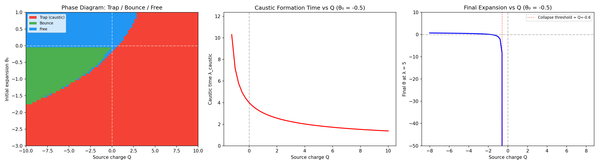

# Signed Source Benchmark Pack

## Summary

The framework's charge algebra is signed: Q takes values in ℝ, not ℝ≥0. This means positive-source (attractive), negative-source (repulsive), and neutral (screened) sectors all exist. All three weak-field observables flip sign coherently when Q flips sign, and the strong-field phase structure shows trap/bounce/free regions with clear boundaries.

## Formal chain (Lean 4, zero custom axioms)

| File | Key results |
|------|-------------|
| `SignedSource.lean` | Q ∈ ℝ; positive/negative sectors exist; perfect cancellation Q(h+(-h))=0; additivity; trichotomy |
| `SourceFocusing.lean` | Under FocusingHypothesis (κ>0): Q>0 focuses, Q<0 defocuses, Q=0 neutral; screening reduces focusing; overscreening reverses it |
| `FocusingBridge.lean` | Ricci tensor and null focusing functional are linear in MetricDerivs (exact, non-perturbative) |

**FocusingHypothesis** is a named structure, not a hidden axiom. All downstream results are explicitly conditional on it.

## Weak-field sign table (11/11 checks pass)

| Case | Q | Focusing | Deflection | Shapiro |
|------|---|----------|------------|---------|
| Positive source | +2.0 | converge | inward | delay |
| Neutral | 0.0 | none | none | none |
| Negative source | -2.0 | diverge | outward | advance |

- Magnitude symmetry: |obs(Q)| = |obs(-Q)| for deflection and Shapiro
- Source: `signed_source_observables.py`

## Strong-field benchmark (6/6 checks pass)

| Test | Q | Outcome |
|------|---|---------|
| Trapping | +10 | caustic (θ → -∞) |
| Anti-trapping | -10 | no caustic (θ = +0.79) |
| Bounce | -5 (θ₀=-0.5) | convergence reversed (θ → +0.31) |
| Collapse | +5 (θ₀=-0.5) | caustic |
| Nonlinear asymmetry | ±3 | |θ(+Q)|/|θ(-Q)| = 2.07 |
| Critical threshold | sweep | trapping stops at Q ≈ 1.5–2.0 |

Key finding: the nonlinear -θ²/2 Raychaudhuri term creates asymmetry. Positive source is "stronger" than negative source nonlinearly because self-focusing amplifies while self-defocusing decelerates.

Source: `signed_source_strong_field.py`

## Phase diagram (5/5 checks pass)

Three panels:
1. **Phase diagram** in (Q, θ₀) space: trap (red), bounce (green), free (blue)
2. **Caustic time** vs Q: monotonically decreasing; no caustic for Q < 0
3. **Final θ** vs Q: sharp collapse threshold at Q ≈ -0.6

Phase statistics (81×61 grid): 70.9% trap, 13.0% bounce, 16.1% free.

Source: `signed_source_phase_diagram.py`

## What is established

- The charge algebra **allows** anti-source sectors (Q < 0)
- Screening and cancellation are **exact** consequences of linearity
- All three weak-field observables flip sign **coherently**
- Strong-field behavior shows **three distinct phases**
- Negative source **prevents trapping** for mildly convergent beams
- Nonlinear regime creates **asymmetry**: focusing > defocusing in magnitude

## What remains conditional

- **FocusingHypothesis**: source sign controlling Ricci focusing (κ > 0) is named and explicit, not derived from the Einstein equation
- **Physical admissibility**: whether nature permits Q < 0 gravitational sources is outside the algebraic chain
- **Stability**: dynamical stability of negative-source configurations is not addressed

## Honest one-line summary

The framework formally allows anti-source sectors and proves coherent sign reversal across all weak-field observables, with a three-phase strong-field structure, but the physical realizability of stable repulsive gravitational solutions remains an open conditional.
